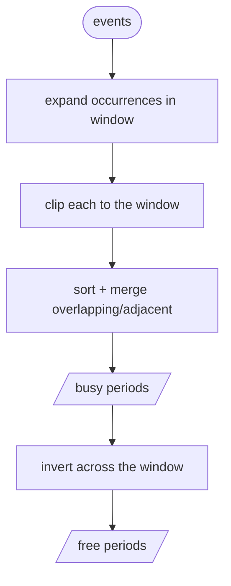

# Free / Busy

Given a set of events, compute when someone is busy — and the gaps when they're
free. Recurrences are expanded automatically.

```go
from := time.Date(2026, 1, 5, 8, 0, 0, 0, time.UTC)
to := from.Add(10 * time.Hour) // a working day

busy, free := icalendar.FreeBusy(events, from, to)
for _, p := range free {
    fmt.Printf("free %s–%s\n", p.Start.Format("15:04"), p.End.Format("15:04"))
}
```

## How it works



- **`BusyPeriods(events, from, to) []Period`** — every event's occurrences,
  clipped to the window and merged into a sorted, non-overlapping list.
  CANCELLED events are skipped; all-day events contribute their full span; an
  event that starts before the window but runs into it is still counted.
- **`FreeBusy(events, from, to) (busy, free []Period)`** — the busy list plus
  the free gaps that fill the rest of `[from, to)`.

A `Period` is a half-open interval:

```go
type Period struct {
    Start, End time.Time
}

func (p Period) Duration() time.Duration
func (p Period) Contains(t time.Time) bool
```

## Finding a free slot

```go
busy, free := icalendar.FreeBusy(events, from, to)
_ = busy
for _, gap := range free {
    if gap.Duration() >= 30*time.Minute {
        fmt.Println("can meet at", gap.Start)
        break
    }
}
```
