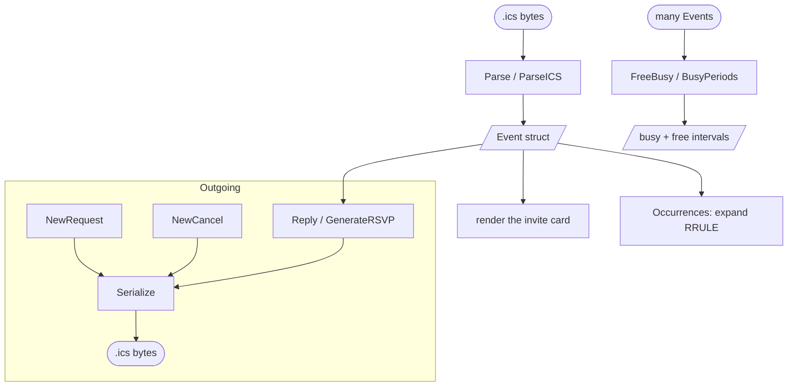

# go-icalendar

`go-icalendar` is an ergonomic wrapper around the iCalendar (RFC 5545) and
iMIP/iTIP (RFC 6047 / RFC 5546) formats for Go email clients and schedulers. It
turns the low-level property bag exposed by the underlying parser into a flat,
render-ready `Event` struct, and provides the scheduling glue a mail client
otherwise has to write by hand.

It was extracted from [matcha](https://github.com/floatpane/matcha)'s mail
reader, where it powers the meeting-invite card and the Accept / Decline /
Tentative replies sent back to Google Calendar and Outlook.

## What it does

- **Parse** an `.ics` attachment into one [`Event`](/parsing) (`ParseICS`) or a
  whole `Calendar` of them (`Parse`), with timezone- and all-day-aware
  timestamp handling.
- **Build** outgoing invites — REQUEST, CANCEL and REPLY calendars — and
  serialize them back to RFC-compliant bytes ([Building Invites](/building)).
- **Reply** to a received invite the way Google and Outlook expect, via
  `GenerateRSVP` ([RSVP Replies](/rsvp)).
- **Expand recurrences**: parse an RRULE and enumerate concrete occurrences in
  a window ([Recurrence](/recurrence)).
- **Compute availability**: merge events into busy intervals and the free gaps
  between them ([Free / Busy](/freebusy)).

## Features

- **Flat `Event`.** Summary, times, organizer, attendees, status, recurrence —
  all on one struct, no property lookups at the call site.
- **Correct timestamps.** UTC, floating, `TZID`-qualified and `VALUE=DATE`
  all-day values are handled, including the real-world quirk of a `TZID` wrongly
  attached to a date-only value.
- **iMIP-correct replies.** `GenerateRSVP` reproduces exactly what schedulers
  require: `METHOD:REPLY`, only the responding attendee, updated `PARTSTAT`,
  `RSVP=TRUE`, fresh `DTSTAMP`, and a preserved UID.
- **A real recurrence engine.** DAILY/WEEKLY/MONTHLY/YEARLY with INTERVAL,
  COUNT/UNTIL, BYMONTH, BYMONTHDAY, BYDAY (ordinals like `2MO` / `-1FR`) and
  BYSETPOS, plus RDATE/EXDATE merging.
- **Single dependency.** Only `github.com/arran4/golang-ical`.

## Sister projects

| Project | Role |
|---------|------|
| [floatpane/matcha](https://github.com/floatpane/matcha) | Reference consumer — renders invites and sends RSVPs. |
| [floatpane/go-secretbox](https://github.com/floatpane/go-secretbox) | Sibling extraction — password-based encryption at rest. |

> [!NOTE]
> The import path is `github.com/floatpane/go-icalendar` and the package name
> is `icalendar`.
