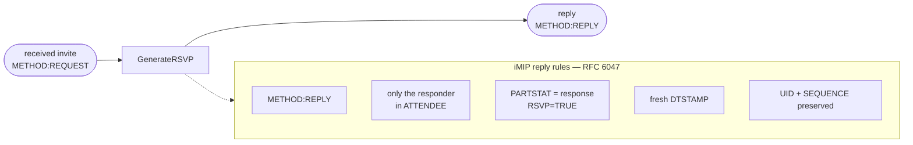

# RSVP Replies

Replying to an invite is fiddly: Google Calendar and Outlook only register your
response if the reply is shaped exactly right. `GenerateRSVP` does that shaping.

```go
reply, err := icalendar.GenerateRSVP(originalICS, "me@example.com", "ACCEPTED")
```

`response` is one of `"ACCEPTED"`, `"DECLINED"`, `"TENTATIVE"`.

## What it produces



`GenerateRSVP` works from the **original bytes**, not a re-serialized event, so
the UID, SEQUENCE, recurrence and organizer survive byte-for-byte — which is
what lets the organizer's calendar match your reply to the right meeting.

## Sending it

Send the reply as a `text/calendar` part with `method=REPLY` — and crucially,
*not* as an attachment:

```
Content-Type: text/calendar; charset=UTF-8; method=REPLY
```

Most clients send a `multipart/alternative` of `text/plain` + the inline
`text/calendar`, with the `.ics` also attached so every recipient client can
read it.

## Replying from an Event

If you only hold a parsed `Event` (not the raw `.ics`), use `Event.Reply`:

```go
cal := ev.Reply("me@example.com", icalendar.PartStatAccepted)
reply, _ := cal.Serialize()
```

Prefer `GenerateRSVP` when you still have the original bytes — it preserves more
of the invite verbatim.
